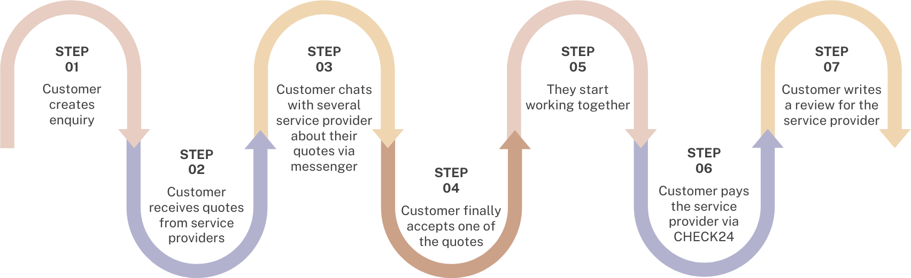

# CHECK24 GenDev Messenger Challenge

**Note:**
This is the challenge for the **4th round** of the [GenDev Scholarship](https://check24.de/gen-dev).
We're looking forward to your application - happy coding. 🤓

This coding challenge is about a messenger (app 📱 or web 💻) you may know from our service provider comparison product "CHECK24 Profis". After creating an enquiry for any of our provided services (mover, DJ, a broad range of craftsmen, ...) the customer is able to receive quotes from service providers within their region. To keep things simple, starting from the point the customers is interested, they're able to chat with each other through our messenger. As it seems simple for end users, there is quite some logic needed to create a seamless chat experience. 😀

Sounds like a challenge you want to tackle? Let's dive into it! 🤓

## Table of contents
1. [Background, how does CHECK24 Profis work?](#background)
    1. [Screen: chat overview](#chat-overview)
    2. [Screen: messenger](#messenger)
2. [The challenge](#the-challenge)
    1. [Minimum requirements](#minimal-requirements)
    2. [Get creative (add more features)](#get-creative)
    3. [Dataset explanation](#datasets--cases)
6. [How do I hand in my project?](#how-do-i-hand-in-my-project)

## Background

CHECK24 Profis is one of our products where you're able to compare local service providers for a broad range of provided services (e.g. DJ, moving companies, craftsmen, ...).

To give you an idea of the process of a customer enquiry at CHECK24 Profis, take a look at the following graphic:

The following image shows the messenger from both perspectives:

## The challenge

Thinking about a messenger like WhatsApp or Telegram or - obviously - the one from CHECK24: you may not think of the challenges that comes with building them.

Your messenger consists of two components: the backend and the frontend (messenger). So, you need to write a backend providing the data for the frontend,  displaying it nicely. The frontend could be an iOS, Android or Web App. Choose any stack you want, feel free to try something new. 🤓

We provide you with...
- some [conversations data](#conversations) as a basic seed of data in a basic format
- some [minimal requirements](#minimal-requirements) that should get implemented
- [UI examples](./example-ui) to give you a head start and to focus on what matters: functionality

Feel free to use our provided UI as a starting point or get creative yourself by building what you think offers the best UX.

Put your project on GitHub (private repository!) and use it to apply for the 4th round of the [GenDev Scholarship](https://check24.de/gen-dev).

*Applications are open between 1st of September and 31st of October 2023.*

### Note ℹ️

This challenge is not primarily about ticking the boxes (we give you minimal requirements only to guide your project in the right direction). It should be a coding project that is fun for you to work on. 😊 There is no time limit. Try to build something cool you are proud of and impress us (by having a clever UI or some cool additional features). We are excited for your solutions. 🥳

### Minimal requirements

*Heads up: each chat starts with a quote message of the service provider.*

1. **Chat view**: the same conversation should be viewable from _both perspectives_: customer and service provider (they should each have their own site/route, so that hypothetically a service provider on one device is able to chat with the customer on the other device)
2. **Overview over all chats**: think about implementing simple(!) chat overviews for both perspectives to click into chats, too.
2. **Persistance**: chats are mutable, so they should be persisted in a database/store of your choice and accessible via an unique identifier
3. **Scrolling pagination**: the customer/service provider should be able to scroll through a chat (and its history) with a hypothetical length of 10000s of messages per chat (think about Pagination)
4. **Image and PDF attachments**: The customer/service provider should be able to send messages with optional attachments like pictures or documents (PDF)
5. **Masking of sensible information**: Any contactable data (phone, email, URL) within all messages should be masked as long as the conversation status is ["quoted"](#conversation-status)
6. **Show sent message in chat without refreshing**: Messages should appear within the chat as they were sent (without refreshing the page)
7. **Hide message field if rejected state**: If a conversation status is ["rejected"](#conversation-status) the message input field should disappear and actions should not be possible any longer
8. **Request customer reviews**: Within the chat the service provider should be able to request a review from the customer once they've worked together (feature explicitly explained [within our provided datasets](#datasets--cases))
9. A **quick screencast 🎥 of your final working app** within your GitHub repository (+ optional a link to a live version to check out *or* an explanation how to start your app on our machines, see ["How do I hand in my project?"](#how-do-i-hand-in-my-project))

### Get creative

As the above requirements are just the minimum, we want you to feel free to extend your chat and impress us. What else could the messenger of your choice have implemented (besides message types)?

To give you some ideas of challenges/features building a messenger you could think of, depending on your implementation:

- [Unread banner behaviour](https://github.com/check24-scholarships/check24-messenger-challenge-datasets/blob/master/cases/unread-banner.md) (highly appreciated)
- An extendable/generic message API format (consider whether your API design is also suitable for new product requirements e.g. new message types)
- Thumbnail processing (to improve UX)
- Live-Updates (Socket/Polling/...)
- Start the conversation at the scroll offset of the first unread message
- Dockerize your system so that anyone can run it on their machine
- OpenAPI for backend <-> frontend communication (+ code generation)

### Datasets & cases

We provide you with a dataset of two conversations and some additional informations for the review & unread banner cases for this challenge. To get access to the datasets and cases click on the "Start the challenge" button at the [end of the page](#how-do-i-hand-in-my-project). You will automatically be invited to the organization where you'll find the [check24-scholarships/check24-messenger-challenge-datasets](https://github.com/check24-scholarships/check24-messenger-challenge-datasets) repository.

#### Conversations

Let's talk about the structure of these conversation datasets.

The conversations dataset will look like this:

| id | customer_name   | service_provider_name | state    | created_at          | updated_at          | deleted_at |
|----|-----------------|-----------------------|----------|---------------------|---------------------|------------|
|  1 | Reyes Herzog    | Colton Ruecker        | quoted   | 2022-10-06 20:03:32 | 2023-06-13 19:06:49 |            |
|  2 | Alycia Homenick | Amparo West           | rejected | 2022-10-21 12:30:12 | 2023-07-01 04:39:25 |            |

Every row represents a conversation between a customer and a service provider.

#### Conversation status

A conversation can (by default, feel free to extend) have three states.

- `quoted` is the initial state where the service provider sent its quote to the customer. The customer has to decide to review the initial quote message. Both, the customer and service provider, are already able to chat about the given quote, talking about details, before accepting/rejecting the quote ***but only if(!)* the customer starts chatting first**
- `accepted` means the initial quote the service provider sent was accepted by the customer and further actions (e.g. customer writing a review, sending a hypothetical payment, ...) can only happen in this state
- `rejected` means the initial quote got rejected by the customer

#### Messages

On the other hand there are messages. Messages relate to a conversation. The messages dataset will look like this:

| id | conversation_id | message_type         | text                                                                     | sender_type      | read_at             | created_at          | updated_at          |
|----|-----------------|----------------------|--------------------------------------------------------------------------|------------------|---------------------|---------------------|---------------------|
| 1  | 2               | quote_offer          | Hey,\nwe would like to work with you. Please accept our quote of $ 1.500 | service_provider | 2023-07-27 16:52:04 | 2023-07-26 16:52:04 | 2023-07-26 16:52:04 |
| 2  | 2               | reject_quote_message | That's too expensive, sorry                                              | customer         | 2023-07-27 16:52:04 | 2023-07-26 11:12:02 | 2023-07-26 11:12:02 |
| 3  | 1               | quote_offer          | Hey,\nwe would like to work with you. Please accept our quote of $ 1.500 | service_provider | 2023-07-27 16:52:04 | 2023-08-03 19:29:23 | 2023-08-03 19:29:23 |
| n  | x               | ...                  | ...                                                                      | ...              | ...                 | ...                 | ...                 |

- `read_at` indicates a date time when the given message was viewed/read by the receiver and display it nicely to the sender by having checkmarks (see [UI examples](./example-ui/README.md)) within their chat message bubble.
- `hidden_at` should indicate that a message gets hidden when reaching the specified datetime (must not be set)

#### Message types

The basic version of the messenger is capable of the following `message_type`'s:

- `quote_offer`
    - is always the first message in a conversation (must exist)
    - contains a message of the service providers quote
- `reject_quote_message`
    - can only get generated on behalf of a customer
    - appears in case a quote got rejected by the customer
    - customer should be able (but not forced) to send a message within
- `accept_quote_message`
    - can only get generated on behalf of a customer
    - in case a quote got accepted by the customer
    - customer is able (but not forced) to send a text within
- `standard_message`
    - a normal text message, either the customer or service provider can send to each other

You can find UI examples of these message types [here](./example-ui/README.md).

ℹ️ Feel free to extend, adjust or remove this type of information as you like, as long as you're achieving the minimal requirements.

#### Sender types

Also, the possible `sender_type` values for the basic version of the messenger are:

- `service_provider`
- `customer`

ℹ️ Feel free to extend, adjust or remove this type of information as you like, as long as you're achieving the minimal requirements.

## How do I hand in my project?

Create a private GitHub repository and commit your code there. Provide READ permissions to messengerchallenge@check24.de then, so that we can see what you have been building. When you hand in your application for the scholarship on our scholarship website include the link to your GitHub repository.

What should be included:

- Your working code
- A toplevel README.md that explains your approach (including possible optimizations)
- We want to see your project in action. To achieve that there are two options:
    - Make your project runnable for everybody (e.g. by having a docker-compose.yaml). If this is possible for your project please add a section "How to run locally" to your project's README.md.
    - Run your project in your own environment and demonstrate it by using screen recording (there are plenty of tools that can support you with that). The recoding should show the main features of your messenger (run a few scenarios, review messages, unread banner, ...). Upload that video somewhere (e.g. YouTube or some other cloud and include a link to it in your README.md).

So, what else? Have fun! We're looking forward hearing from you! 😎

<a href="https://check24-4th-gendev.vpetritz.net">Click here to start the challenge and access the datasets 🚀</a>

### Questions?
In case of any questions, contact messengerchallenge@check24.de.
