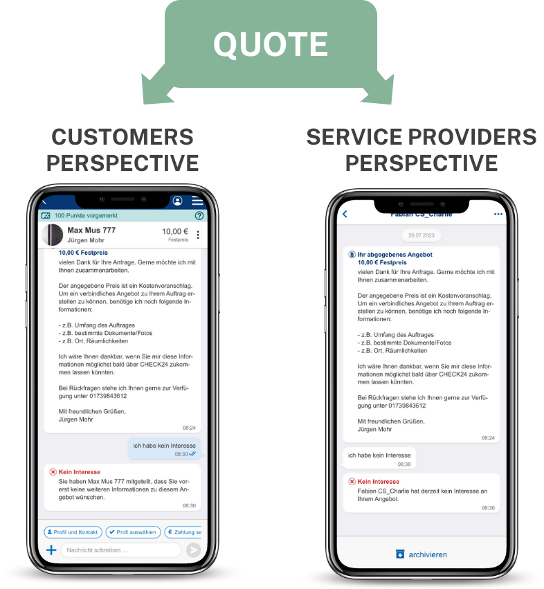

# Example UI

ℹ️ The screenshots/video below are just examples to give you an idea of what your messenger could look and behave like. Feel free to use the given HTML or design your own messenger from scratch. Impress us by creating your messenger experience!

Here you go:
- [Customers chat perspective](./customer-chat.html)
- [Service providers chat perspective](./service-provider-chat.html)